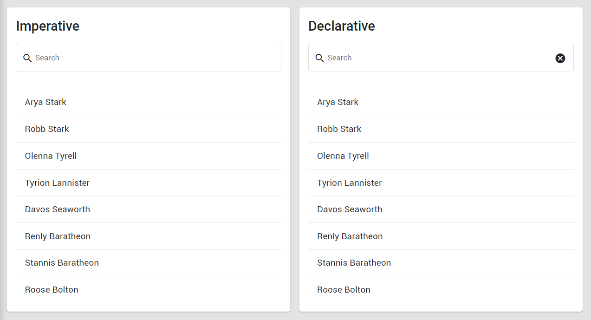

Follow this tutorial if you want to learn the difference between imperative and declarative(reactive) programming in Angular:
https://eliteionic.com/tutorials/imperative-vs-declarative-programming-with-rxjs-search-filter/

Stack used: Angular 13, RxJS, Angular Material, Tailwind CSS

I definitely prefer a reactive programming approach whenever possible!

